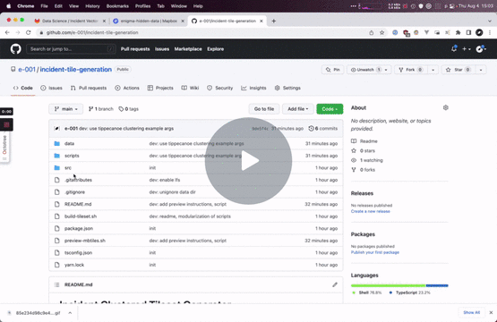

# Incident Clustered Tileset Generator

In the interest of client performance, we generate a zoomable tileset with clustering pre-computed.

[](https://www.loom.com/share/44187d495b2c4c91a3a45ad0c1c4792f)


## Dependencies
- Install node packages with `yarn install`. Install graphqurl globally with `yarn global add graphqurl`.
- Install [tippecanoe](https://github.com/mapbox/tippecanoe#installation) `brew install tippecanoe`.
- Set the `GRAPHQL_TOKEN` env variable to match the admin secret.

## Running
The `build-tileset.sh` script in the project root performs the necessary operations. See the component scripts in the `src/` dir for implementation.

1. `01-gql-fetch.sh` Download incident survey features via GQL.
2. `02-gql-to-geojson.sh` Converts the features to a FeatureCollection.
3. `03-geojson-to-mbtiles.sh` Generates an MBTile file from the passed collection.

The upload script, `04-upload-tilesets.sh`, is run manually.

## Preview generated tiles
Use [`mbview`](https://github.com/mapbox/mbview) to preview generated tilesets. To install:
1. `yarn global add mbview` or `npm i -g mbview`
2. `$ export MAPBOX_ACCESS_TOKEN=...`
2. `$ ./preview.sh`

## Outputs
Generated and fetched outputs are in the `out` directory.
```
├── geojson
│   ├── incident.geojson  // fetched incidents mapped to geojson
│   └── library.geojson   // ibid., library
├── gql
│   └── result.json       // raw gql result
└── mbtiles
    ├── cluster.mbtiles   // clustered incidents, uploaded
    ├── highzoom.mbtiles  // clustered incidents, high zoom, includes IDs
    ├── library.mbtiles   // library, unclustered, upload
    ├── lowzoom.mbtiles   // clustered, low zoom, no IDs
    └── nocluster.mbtiles // all incidents, unclustered, with years, uploaded
```

## Deploy
### Compose
```
$ export GRAPHQL_TOKEN="XXX"
$ docker-compose up --build
```
### Docker
```
$ docker build -t tileset-gen .
$ docker run --rm -v $PWD/out:/app/out -e GRAPHQL_TOKEN=${GRAPHQL_TOKEN} tileset-gen
```

## Publishing to Mapbox Server
Publishing to Mapbox uploads the generated tilesets to Mapbox, replacing those used by Enigma applications. It is **not** run by default. This replaces existing tilesets with the generated  files in `out/mbtiles`.

```
 $ export MAPBOX_ACCESS_TOKEN="sk.xyz123"
 $ ./src/04-upload-tilesets.sh
 ```

The Mapbox token must have tileset and data write permissions.
